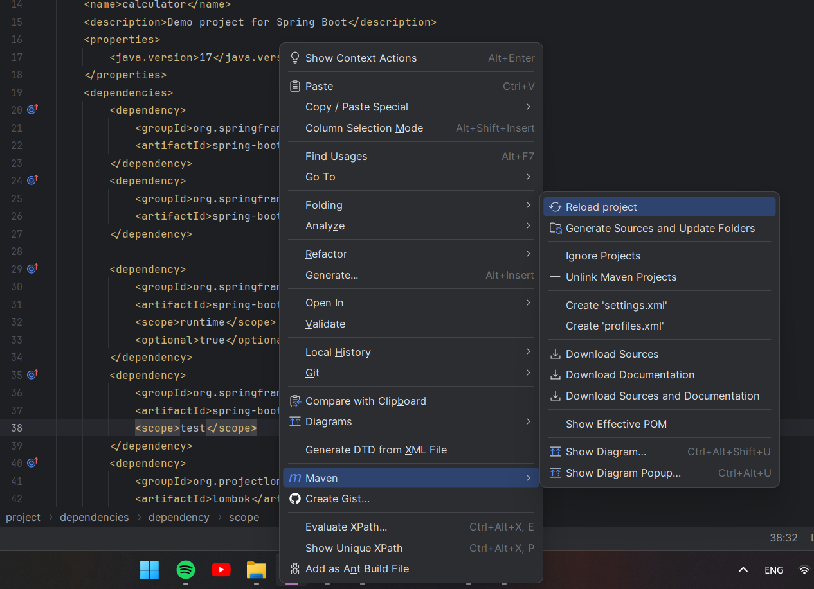

# Financial calculator

## Start application from Docker container
Open terminal and run the following commands:
1. `docker pull egerrmann/calculator` for step 1 or `docker pull egerrmann/calculator-step2` for step 2
2. `docker run -p 8000:8080 egerrmann/calculator` or `docker run -p 8000:8080 egerrmann/calculator-step2`

After all follow the url localhost:8000/index

## Start application from GitHub
You need to download the complete project, unarchive .zip and open it in the IDE.
There are some dependencies used in the application, that's why you have to
open the pom.xml file in the root folder and Reload project using Maven 
by right-clicking in the pom.xml (see the screenshot)

IntelliJ IDEA

Then follow the url localhost:8080/index 